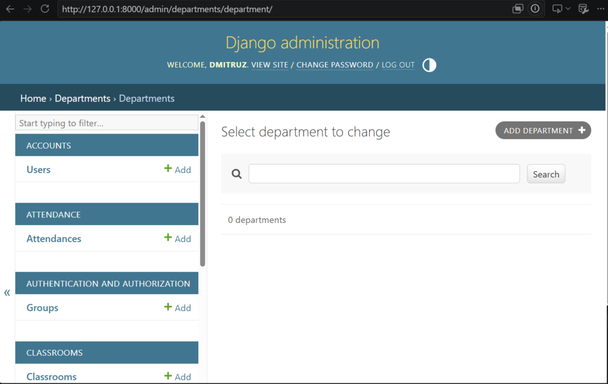
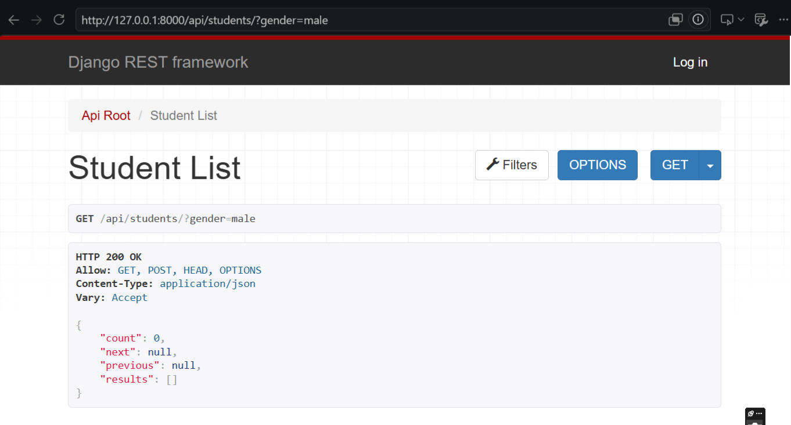
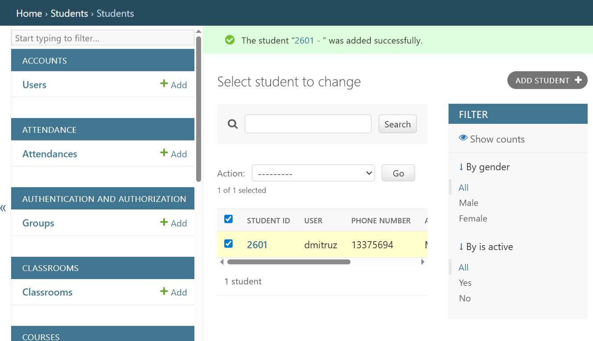
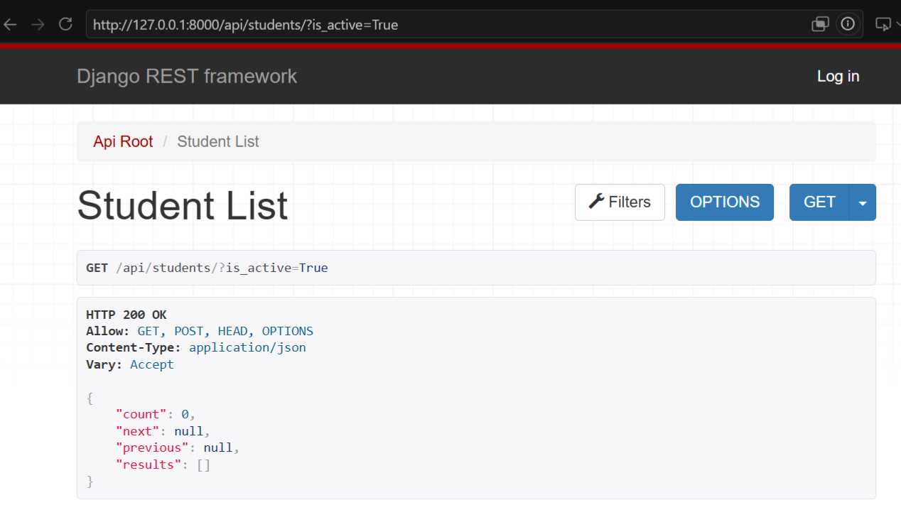

# College ERP

A Django-based College ERP (Enterprise Resource Planning) system designed to manage academic and administrative operations through a RESTful API.

The project provides a backend foundation for managing students, faculty, departments, courses, enrollments, attendance, examinations, grades, timetables, classrooms, fees and notifications.

---

## 📌 Overview

College ERP is a backend application built with Django and Django REST Framework.

The system is designed around the main entities and workflows of a college, providing a centralized API for managing academic information and administrative processes.

The project currently focuses on the backend and REST API. A frontend application can be added later and consume the API.

### Main objectives

- Centralize college academic data
- Provide a RESTful API
- Implement secure authentication
- Manage students and faculty
- Manage courses and enrollments
- Track attendance
- Manage examinations and grades
- Manage academic timetables and classrooms
- Provide administrative functionality through Django Admin

---

## ✨ Features

### Authentication

- Custom Django User model
- JWT authentication
- Access and refresh tokens
- User roles:
  - Admin
  - Faculty
  - Student

### Academic Management

- Departments
- Students
- Faculty
- Courses
- Enrollments
- Attendance
- Classrooms
- Timetable
- Exams
- Grades

### Administration

- Fees management
- Notifications
- Django Admin interface
- PostgreSQL database

### REST API

- CRUD operations through Django REST Framework
- JWT-protected endpoints
- Filtering
- Searching
- Ordering
- Serializer validation
- API documentation with Swagger/OpenAPI

---

## 🛠️ Tech Stack

| Technology | Purpose |
|---|---|
| Python | Programming language |
| Django | Backend framework |
| Django REST Framework | REST API |
| PostgreSQL | Database |
| Simple JWT | JWT authentication |
| django-filter | API filtering |
| drf-yasg | Swagger/OpenAPI documentation |
| django-cors-headers | CORS support |
| django-extensions | Django development utilities |
| Pillow | Image handling |
| python-decouple | Environment configuration |
| Git / GitHub | Version control |

---

## 🏗️ Architecture

```text
                         Client
                           │
                           ▼
                  Django REST API
                           │
             ┌─────────────┴─────────────┐
             │                           │
        JWT Authentication          API Endpoints
             │                           │
             └─────────────┬─────────────┘
                           │
                    Django Models
                           │
                           ▼
                       PostgreSQL

## Project Structure

college_erp/
│
├── accounts/
│   ├── models.py
│   ├── admin.py
│   └── ...
│
├── students/
├── faculty/
├── departments/
├── courses/
├── enrollments/
├── attendance/
├── classrooms/
├── timetable/
├── exams/
├── grades/
├── fees/
├── notifications/
│
├── config/
│   ├── settings.py
│   ├── urls.py
│   └── ...
│
├── manage.py
├── requirements.txt
├── .env
├── .gitignore
└── README.md

## Main Entities

                    Department
                   /    |     \
                  /     |      \
                 ▼      ▼       ▼
            Students  Faculty  Courses
                │                 │
                │                 │
                ▼                 ▼
           Attendance        Enrollments
                │                 │
                │                 ▼
                │               Exams
                │                 │
                ▼                 ▼
              Results / Grades
                   
             Timetable
                 │
                 ▼
             Classroom

             Students
                 │
                 ├── Fees
                 └── Notifications

## REST API

The API is organized around the main ERP resources.

Students
/api/students/

Supported operations include:

Method	Endpoint	Description
GET	/api/students/	List students
POST	/api/students/	Create student
GET	/api/students/{id}/	Retrieve student
PUT	/api/students/{id}/	Update student
PATCH	/api/students/{id}/	Partially update student
DELETE	/api/students/{id}/	Delete student

## Other Resources

/api/faculty/
/api/departments/
/api/courses/
/api/enrollments/
/api/attendance/
/api/classrooms/
/api/timetable/
/api/exams/
/api/grades/
/api/fees/
/api/notifications/

## Filtering, Searching and Ordering

The API supports filtering and other query operations through Django REST Framework and django-filter.

Example:

GET /api/students/?department=1

Search example:

GET /api/students/?search=john

Ordering example:

GET /api/students/?ordering=student_id

API Documentation

Interactive API documentation is provided using Swagger/OpenAPI.

After starting the development server, the documentation can be accessed through the configured Swagger endpoint.

http://127.0.0.1:8000/api/docs/
⚙️ Installation
1. Clone the repository
git clone https://github.com/dmitruz/college_erp
cd college_erp
2. Create a virtual environment
python -m venv venv
Windows
venv\Scripts\activate
Linux / macOS
source venv/bin/activate
3. Install dependencies
pip install -r requirements.txt
4. Configure environment variables

Create a .env file in the project root.

Example:

SECRET_KEY=your-secret-key
DEBUG=True


DB_NAME=college_erp
DB_USER=postgres
DB_PASSWORD=your-password
DB_HOST=localhost
DB_PORT=5432

Never commit your real .env file or database credentials to GitHub.

5. Apply migrations
python manage.py migrate
6. Create an administrator
python manage.py createsuperuser

Follow the prompts to create the Django administrator account.

7. Run the development server
python manage.py runserver

The application will be available at:

http://127.0.0.1:8000/
🖥️ Django Admin

The project includes Django Admin for managing ERP data.

http://127.0.0.1:8000/admin/

The administration interface provides access to the application's main models, including:

Users
Students
Faculty
Departments
Courses
Enrollments
Attendance
Classrooms
Timetable
Exams
Grades
Fees
Notifications
🧪 Testing and Validation

Run Django's system checks:

python manage.py check

Run the test suite:

python manage.py test

Check migration status:

python manage.py showmigrations
🚀 Deployment

The application is designed to be deployed as a production Django REST API backed by PostgreSQL.

Planned production architecture:

              Frontend / API Client
                       │
                       ▼
                Django REST API
                       │
                       ▼
                   PostgreSQL

Production configuration will include:

Environment variables
DEBUG=False
Production database
Static file handling
CORS configuration
Secure secret key configuration
Production web server

Deployment details and the live API URL will be added once the application is deployed.

📸 Screenshots
## Django Admin



## API



## Filtering



## Active Students



🗺️ Roadmap
Completed
 Django project setup
 PostgreSQL integration
 Custom User model
 Departments
 Students
 Faculty
 Courses
 Enrollments
 Attendance
 Classrooms
 Timetable
 Exams
 Grades
 Fees
 Notifications
 Django Admin
 Django REST Framework
 JWT authentication
 API filtering
 API searching
 API ordering
 Initial role-based permissions
Planned
 Complete role-based authorization
 Object-level permissions
 Complete API coverage for all ERP resources
 Automated API tests
 Improved Swagger documentation
 Production deployment
 Docker containerization
 CI/CD pipeline
 React frontend
🔮 Future Improvements

Possible future improvements include:

React frontend
Docker and Docker Compose
CI/CD with GitHub Actions
Advanced role-based access control
Object-level permissions
Email notifications
File and document management
Advanced reporting
Automated testing
Production monitoring
📄 License

This project is currently developed as a portfolio and educational project.

👨‍💻 Author

Dmytro Ruzhytskyi

GitHub: https://www.github.com/dmitruz
LinkedIn: https://www.linkedin.com/in/dmytro-ruzhytskyi/
